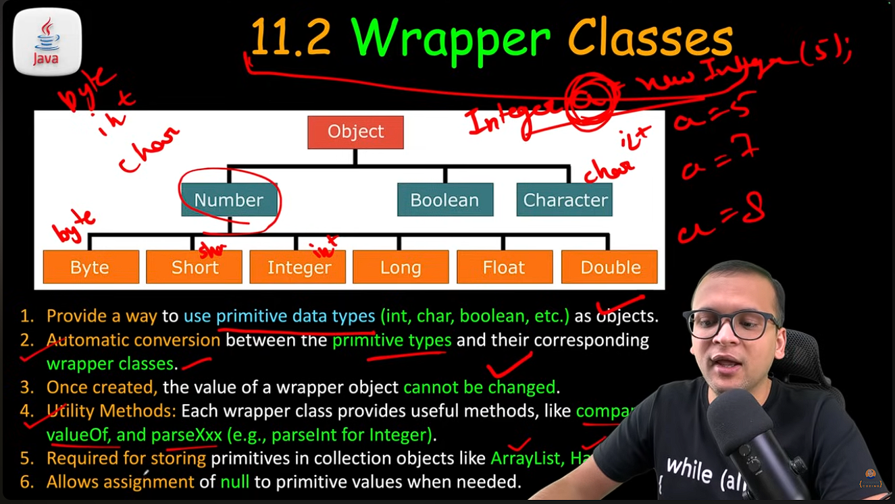

Variable Arguments
-----------------
-----------------
- By VarArgs we can create multiple arguments taking function without needing to rewrite the same function we different no. of arguments.
```
 String foo( String ...elements){ // it acts as an array normally
    String result;
    for( var element : elements){
        result += elements;
    }
    return result;
 }
```
- It save us from re-writing the code for overloading of no. of arguments
- ### ( ... ) this is called ellipsis operator
- intenal handling is as a Array




### AutoBoxing
- Autoboxing refers to the automatic converiosn of primitive types  to their corresponding wrapper class;
- Unboxing : auto. conversionn of wrapper class  objects back to its primitive types