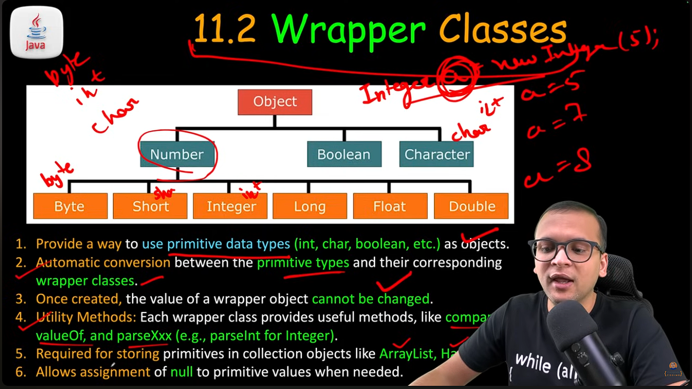
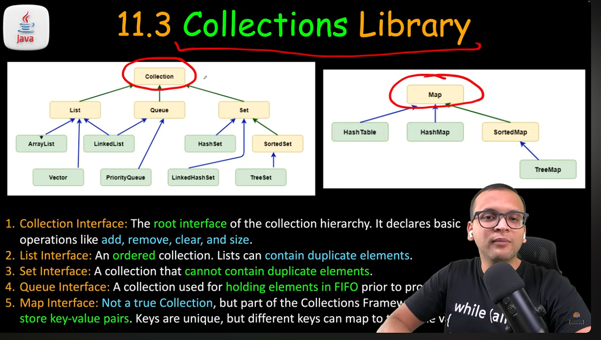

Variable Arguments
-----------------
-----------------
- By VarArgs we can create multiple arguments taking function without needing to rewrite the same function we different no. of arguments.
```
 String foo( String ...elements){ // it acts as an array normally
    String result;
    for( var element : elements){
        result += elements;
    }
    return result;
 }
```
- It save us from re-writing the code for overloading of no. of arguments
- ### ( ... ) this is called ellipsis operator
- intenal handling is as a Array




### AutoBoxing
- Autoboxing refers to the automatic converiosn of primitive types  to their corresponding wrapper class;
- Unboxing : auto. conversionn of wrapper class  objects back to its primitive types


- ###  Yellow colored are interfaces
- ### and other are classes or object defined under them

## List Element

List can be defined as 
``` 
    List list = new ArrayList() // since List is an interface so to make an object we need to use ArrayList()
    // as this type of list declaration can accept any data type which can cause problem
    
    /// Java Introduced type Based list 
    List<String> stringList = new ArrayList<>() 
   
    //'<>' this is called diamond operator , so in it no need to type Type everywhere
    //which infers the left handside type
```

- get(idx) - O(1)
- set(idx , ele) - replacing - O(1)
- add(ele) (at last ) - O(1)
- add(idx , element) - O(N)
- remove(idx) - O(N)
- remove(Obj) - O(N)
- indexOf(Obj) or contains(Obj) - O(N)

#### (`<String>`) This is called Generic by which help we can define type of the collections
Generic type are only exist during compile time, it not been in the after compile

### Set Can't maintain the order so it Collections.sort(set) or etc won't work on it because It worked in order place.

### List created through `````'List.of'````` is always Immutable
### `````List<Integer> list = List.of(elements...); // is an immuateble list `````